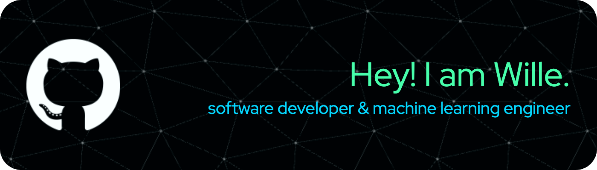

# About Me

<!-- credit: https://github.com/leviarista/github-profile-header-generator -->

I am currently a postgraduate student enrolled in the [Master of Information Technology (Computing)](https://study.unimelb.edu.au/find/courses/graduate/master-of-information-technology/) at the University of Melbourne.

I have a strong and diverse passion for software development and artificial intelligence. I love exploring new technologies and continuously improving my skills.

## Programming Languages

    
    
    
    
    

<!-- credit: https://devicon.dev/ -->

## Tools

    
    
    
        
    
    
    
    
    
    
    
    
    
    
    
    
    
    
    

<!-- credit: https://devicon.dev/ -->

## Interests

- **software development**: I have a deep interest in software development, particularly in building responsive and interactive applications using Java and Python.
- **artificial intelligence**: I am passionate about leveraging machine learning and deep learning to tackle real-world challenges across various domains, particularly in natural language processing (NLP).

## Courses

- **software development**
  - [Android Development (COMP90018)*](https://handbook.unimelb.edu.au/2024/subjects/comp90018)
  - [Cloud Computing (COMP90024)](https://handbook.unimelb.edu.au/2024/subjects/comp90024)
  - [Distributed Systems (COMP90015)](https://handbook.unimelb.edu.au/2023/subjects/comp90015)
  - [Haskell and Prolog (COMP90048)](https://handbook.unimelb.edu.au/2024/subjects/comp90048)
  - [Project Management (SWEN90016)](https://handbook.unimelb.edu.au/2024/subjects/swen90016)
- **artificial intelligence**
  - [Natural Language Processing (COMP90042)](https://handbook.unimelb.edu.au/2024/subjects/comp90042)
  - [Automated Planning (COMP90054)*](https://handbook.unimelb.edu.au/2024/subjects/comp90054)
  - [Machine Learning (COMP90049)](https://handbook.unimelb.edu.au/2023/subjects/comp90049)
- **database**
  - [Advanced Database Systems (COMP90050)](https://handbook.unimelb.edu.au/2023/subjects/comp90050)
- **visualization**
  - [Information Visualization (GEOM90007)](https://handbook.unimelb.edu.au/2023/subjects/geom90007)

Courses marked with an asterisk (\*) are currently in progress and not yet completed.
